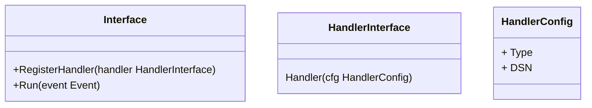

# 自动填充副本字段
在数据库设计时，为了满足搜索、方便查看、单系统完备性的等需求，会将关联的唯一标识之外的字段冗余到当前表中(如将省市区ID记录之外，还记录中文名称字段)。冗余满足了搜索的需求同时，也引入了副作用，首先模糊了模型必备属性字段和冗余字段，提升了模型识别难度，降低了模型的稳定性和复用性；其次填充冗余字段的程序代码和模型代码混合在一起，降低了模型程序的稳定性和通用性。
未解决上述副作用问题，本库基于冗余字段的特点，结合少量规则，实现冗余字段自动填充功能。
冗余字段的数据来源有数据表和接口，填充冗余字段的通用流程：根据资源的唯一标识查询资源信息(从数据表或者接口);再将资源详细信息中需要冗余的信息值赋值给当前冗余字段;最后将新数据填充当前数据模型
冗余字段特点：
1. 字段值不由用户决定，仅有关联的唯一标识决定
2. 部分场景下冗余字段需要同步更新，部分场景(快照)只需新增写入值即可
3. 冗余字段值，可能通过sql查询获得，也可能通过API查询获得
4. 冗余字段，部分场景需要和模型数据同步更新，部分场景(大部分场景)只要求最终一致即可
5. 部分数据的冗余，并非简单的拷贝，需要将已有的值做简单的处理(切割、拼接)
6. 一个表冗余多个其它资源的多个属性
6. 整个表、库、实例为副本或者索引，则需要实现数据的从库和数据异构效果

领域需求：
1. 外部系统必须提供资源新增和修改的事件。当前模型创建、或者更新关联资源唯一标识时，当前系统必须广播更新冗余字段事件（领域内事件）；关联的资源更新后必须广播资源更新内容（领域内、领域外事件）。
2. 何时响应事件。创建类型事件，都需要响应；更新类事件根据需求(比如快照类不响应该事件)响应

## 系统设计：
**事件格式：**
```json
{
    "type":"creating",
    "handlerIdentify":"dbName.tablename/apiName",
    "fields":[
        {"name":"model_field_name","value":"model_field_value","type":"int","primaryKey":"1"},
         {"name":"model_other_field_name","value":"model_other_field_value","type":"string","primaryKey":"1"}
    ],
    "dependencies":[
        {
        "handlerIdentify":"get_source_handler",
        "fields":[
            {"name":"relation_source_id_field","value":"relation_source_id_value","type":"string","primaryKey":"1"},
            {"name":"relation_source_other_arg_1","value":"relation_source_other_arg_1_value","type":"string","primaryKey":"0"}
             ]
        }
    ]
}
```
**字段说明**
|名称|类型|标题|说明|
|--|--|--|--|
|type|string|事件类型|枚举值：<br/> 1. creating-正在创建,等待同步返回，创建的资源ID可能是个占位符 <br/> 2. updating-正在更新，等待同步返回 <br/> 3. created-已经创建，异步返回，保证数据最终一致性即可 <br/> 4. updated—已经更新，异步返回，保证数据最终一致性即可|
|handlerIdentify|string|当前资源命名空间|包含冗余字段模型处理器标识，系统启动时会针对有冗余需求的模型注册全局唯一的handler,handlerIdentify即为handler标识ID|
|fields|array|当前模型字段属性值|一般情况为当前模型的ID,支持复合主键场景。分情况会包含模型中的类型字段等，所有在模型handler中依赖的当前模型属性字段，都集中在这里传递|
|fields.name|string|属性名称||
|fields.value|string|属性名称||
|fields.type|string|值类型|枚举: int,float,string|
|fields.primaryKey|string|是否为主键|枚举: 0-否,1-是|
|dependencies|array|依赖资源|当前事件处理中依赖的资源配置，字段handlerIdentify,fields 含义同上|

**核心接口**



